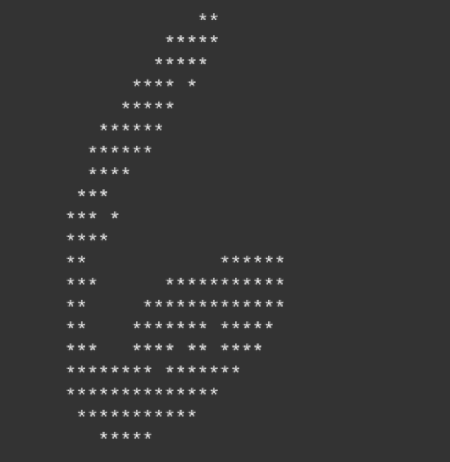

# Assignment 2: Classify

This project implements an Artificial Neural Network (ANN) model using RV32I and provides scripts for testing. The testing uses the MNIST dataset for handwritten digit classification and recognition.



The input to the network will be images from the MNIST dataset, which consists of 60,000 28x28 pixel images of digits ranging from 0 to 9. Each image will be treated as a flattened input vector of size 784 × 1. The network will rely on pre-trained weight matrices 𝑚0 and 𝑚1 to perform matrix multiplications. 

This network apply two types of non-linear activation functions:

* ReLU (Rectified Linear Unit): 
    * ReLU sets all negative values to zero, introducing non-linearity.
* ArgMax: 
    * This function identifies the output neuron with the highest value, indicating the predicted class.

## Prerequisite

### Ubuntu Linux
Ubuntu 22.04 and later versions include the required programs in the default APT repositories. Use the following commands to install them automatically:
```shell
$ sudo apt update
$ sudo apt install curl git openjdk-11-jdk python3 python3-pip
```
### Venus
Run `tools/download_tools.sh` to download the Venus simulator.

## Running RISC-V in Venus
All of the assembly code in this project will be in RISC-V assembly and executed using the Venus simulator. 

To run a RISC-V file with the .jar version, use the following command:
```shell
$ java -jar venus.jar <FILENAME>
```
If you encounter an error related to the maximum instruction count being reached (common with larger MNIST inputs), you can increase the limit using the -ms flag. To remove the limit entirely, set the instruction count to a negative value:
```shell
$ java -jar venus.jar -ms -1 <FILENAME>
```
You can explore additional options by running:
```shell
$ java -jar venus.jar -h
```
## Testing Framework

Running the script `test.sh` with argument `all` will execute all available tests in the tests directory:
```shell
$ ./test.sh all
```
To run specific tests, pass their test IDs as arguments. The test IDs match the names of the .s files. For example, to run the argmax tests:
```shell
$ ./test.sh test_argmax
```
## Test Environment
```shell
$ gcc --version
gcc (Ubuntu 13.2.0-23ubuntu4) 13.2.0

$ lscpu
Architecture:            x86_64
  CPU op-mode(s):        32-bit, 64-bit
  Address sizes:         46 bits physical, 48 bits virtual
  Byte Order:            Little Endian
CPU(s):                  22
  On-line CPU(s) list:   0-21
Vendor ID:               GenuineIntel
  Model name:            Intel(R) Core(TM) Ultra 7 155H
    CPU family:          6
    Model:               170
    Thread(s) per core:  2
    Core(s) per socket:  16
    Socket(s):           1
    Stepping:            4
    CPU(s) scaling MHz:  23%
    CPU max MHz:         4800.0000
    CPU min MHz:         400.0000
    BogoMIPS:            5990.40
``` 

## Result
```shell
$ ./test.sh all
test_abs_minus_one (__main__.TestAbs.test_abs_minus_one) ... ok
test_abs_one (__main__.TestAbs.test_abs_one) ... ok
test_abs_zero (__main__.TestAbs.test_abs_zero) ... ok
test_argmax_invalid_n (__main__.TestArgmax.test_argmax_invalid_n) ... ok
test_argmax_length_1 (__main__.TestArgmax.test_argmax_length_1) ... ok
test_argmax_standard (__main__.TestArgmax.test_argmax_standard) ... ok
test_chain_1 (__main__.TestChain.test_chain_1) ... ok
test_classify_1_silent (__main__.TestClassify.test_classify_1_silent) ... ok
test_classify_2_print (__main__.TestClassify.test_classify_2_print) ... ok
test_classify_3_print (__main__.TestClassify.test_classify_3_print) ... ok
test_classify_fail_malloc (__main__.TestClassify.test_classify_fail_malloc) ... ok
test_classify_not_enough_args (__main__.TestClassify.test_classify_not_enough_args) ... ok
test_dot_length_1 (__main__.TestDot.test_dot_length_1) ... ok
test_dot_length_error (__main__.TestDot.test_dot_length_error) ... ok
test_dot_length_error2 (__main__.TestDot.test_dot_length_error2) ... ok
test_dot_standard (__main__.TestDot.test_dot_standard) ... ok
test_dot_stride (__main__.TestDot.test_dot_stride) ... ok
test_dot_stride_error1 (__main__.TestDot.test_dot_stride_error1) ... ok
test_dot_stride_error2 (__main__.TestDot.test_dot_stride_error2) ... ok
test_matmul_incorrect_check (__main__.TestMatmul.test_matmul_incorrect_check) ... ok
test_matmul_length_1 (__main__.TestMatmul.test_matmul_length_1) ... ok
test_matmul_negative_dim_m0_x (__main__.TestMatmul.test_matmul_negative_dim_m0_x) ... ok
test_matmul_negative_dim_m0_y (__main__.TestMatmul.test_matmul_negative_dim_m0_y) ... ok
test_matmul_negative_dim_m1_x (__main__.TestMatmul.test_matmul_negative_dim_m1_x) ... ok
test_matmul_negative_dim_m1_y (__main__.TestMatmul.test_matmul_negative_dim_m1_y) ... ok
test_matmul_nonsquare_1 (__main__.TestMatmul.test_matmul_nonsquare_1) ... ok
test_matmul_nonsquare_2 (__main__.TestMatmul.test_matmul_nonsquare_2) ... ok
test_matmul_nonsquare_outer_dims (__main__.TestMatmul.test_matmul_nonsquare_outer_dims) ... ok
test_matmul_square (__main__.TestMatmul.test_matmul_square) ... ok
test_matmul_unmatched_dims (__main__.TestMatmul.test_matmul_unmatched_dims) ... ok
test_matmul_zero_dim_m0 (__main__.TestMatmul.test_matmul_zero_dim_m0) ... ok
test_matmul_zero_dim_m1 (__main__.TestMatmul.test_matmul_zero_dim_m1) ... ok
test_read_1 (__main__.TestReadMatrix.test_read_1) ... ok
test_read_2 (__main__.TestReadMatrix.test_read_2) ... ok
test_read_3 (__main__.TestReadMatrix.test_read_3) ... ok
test_read_fail_fclose (__main__.TestReadMatrix.test_read_fail_fclose) ... ok
test_read_fail_fopen (__main__.TestReadMatrix.test_read_fail_fopen) ... ok
test_read_fail_fread (__main__.TestReadMatrix.test_read_fail_fread) ... ok
test_read_fail_malloc (__main__.TestReadMatrix.test_read_fail_malloc) ... ok
test_relu_invalid_n (__main__.TestRelu.test_relu_invalid_n) ... ok
test_relu_length_1 (__main__.TestRelu.test_relu_length_1) ... ok
test_relu_standard (__main__.TestRelu.test_relu_standard) ... ok
test_write_1 (__main__.TestWriteMatrix.test_write_1) ... ok
test_write_fail_fclose (__main__.TestWriteMatrix.test_write_fail_fclose) ... ok
test_write_fail_fopen (__main__.TestWriteMatrix.test_write_fail_fopen) ... ok
test_write_fail_fwrite (__main__.TestWriteMatrix.test_write_fail_fwrite) ... ok

----------------------------------------------------------------------
Ran 46 tests in 45.286s

OK
```
